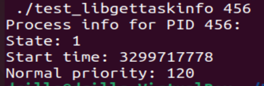

## Place Folder and Code in Right places

** to complete step 1 and 2 run ```./place.sh```

#### 1. add the gettaskinfo folder in the root loaction

```linux-5.10.233/gettaskinfo/```

#### 2. place the header file `gettaskinfo.h` from `linux-5.10.233/gettaskinfo/` to `/include/linux/` getin below loaction

 ```include/linux/gettaskinfo.h```

#### 3. create a syscalls entry: [L:365]

Location: 
```arch/x86/entry/syscalls/syscall_64.tbl```

Add Content: 

```449 common  gettaskinfo     sys_gettaskinfo```

#### 4. add sys call folder in root Makefile: [L:1144]

Replace this:

```core-y		+= kernel/ certs/ mm/ fs/ ipc/ security/ crypto/ block/ io_uring/```

with:

```core-y += gettaskinfo/ kernel/ certs/ mm/ fs/ ipc/ security/ crypto/ block/ io_uring/```

#### 5. update syscalls the header file to reflect the new function signature:

Location: ```include/linux/syscalls.h```

- Add at top [L:86]
```c
#include <linux/gettaskinfo.h>
```

- Add at bottom before last #endif [L:1370]

```c
asmlinkage long sys_gettaskinfo(pid_t pid, char __user *buffer);
```

#

## Build the kernel

1. sudo make menuconfig

2. sudo make -jn

3. sudo make modules_install -jn

4. sudo make install -jn

5. sudo update-grub

#

## Test the system call

1. go to in `lib_gettaskinfo` folder

2. run `install.sh`

3. run the test_lib_gettaskinfo file with PID as cmd arguments

```./test_lib_gettaskinfo <PID>```

### Example Output:

```./test_libgettaskinfo 456```




## Design Decisions

1. used rcu_read_lock() to safely access the task_struct without causing race conditions or memory corruption. because some fields of task_struct may modified. in our case the state and normal_prio may be change. it ensure that till rcu_read_unlock() fields can not changed.

2. to improve the DX, automate the kernel removing process using bash script `clean_kernel_image.sh`.

3. 